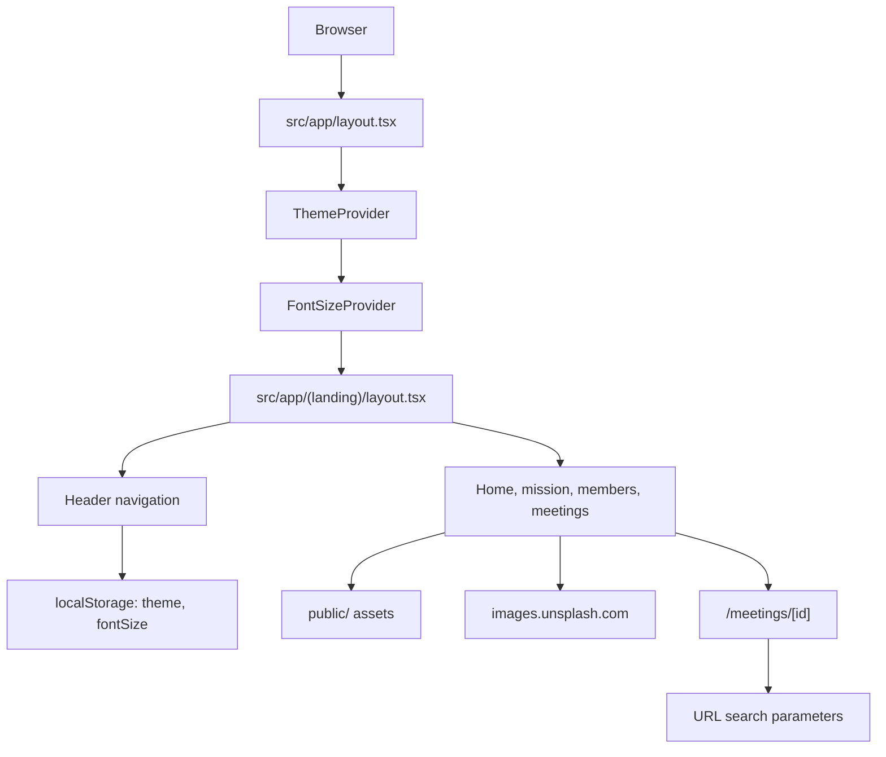

# Academic League of Psychiatry

Institutional website for the Academic League of Psychiatry at Faculdade de Medicina de Jau - Unoeste.

The project presents the league's identity, mission, members, and educational meeting topics in a compact public website built with the Next.js App Router. It is currently a code-managed content site: page copy, members, meeting cards, and meeting detail data are stored directly in React components.

## Project Status

The repository contains a functional Next.js website structure, but it should be treated as a pre-production institutional site until the public content is reviewed.

Current status identified in the codebase:

- Public pages exist for the home page, mission, members, meetings, and meeting details.
- Member names, roles, and several images appear to be sample or placeholder content and require maintainer review.
- Meeting details are passed through URL search parameters rather than loaded from a canonical data source.
- No API routes, database, authentication, test suite, CI/CD workflow, or deployment configuration were identified in the current codebase.
- No license file was identified.
- Browser auto-translation protection was not identified in `src/app/layout.tsx`; this is a TODO before production use because browser translation tools can mutate the DOM.

## Problem It Solves

Academic groups often need a simple public presence that explains who they are, what they study, and how students or visitors can understand their activities. This site solves that basic presentation need for a psychiatry academic league by organizing institutional copy, member information, and meeting topics into a navigable web experience.

## Main Features

- Home page with the league name, institution, introductory copy, and a local group image from `public/grupo.png`.
- Mission page with values, commitments, and academic purpose blocks.
- Members page with board and league member sections.
- Meetings page with a grid of educational psychiatry topics.
- Meeting detail route at `/meetings/[id]` that displays title, description, image, and extended text from query parameters.
- Fixed header navigation across the landing routes.
- Light and dark theme controls backed by `localStorage`.
- Font size controls backed by `localStorage` and applied to the root HTML element.
- Tailwind CSS and daisyUI based styling.
- Local image assets under `public/` and configured support for Unsplash images through `next.config.ts`.

## Technology Stack

| Area | Technology |
| --- | --- |
| Framework | Next.js `15.0.3` |
| UI runtime | React `19.0.0-rc-66855b96-20241106` and React DOM |
| Language | TypeScript |
| Styling | Tailwind CSS `3.4.x`, daisyUI `4.12.x`, global CSS |
| Icons | `lucide-react` |
| Images | `next/image`, local `public/` assets, Unsplash remote images |
| Routing | Next.js App Router |
| State | React context plus browser `localStorage` |

## High-Level Architecture

The app is a small App Router website with three main responsibilities:

1. `src/app/` defines layouts and routes.
2. `src/components/` contains shared headers.
3. `src/context/` provides client-side theme and font-size preferences.



## Folder Structure

```text
academic-league-of-psychiatry/
├── docs/                    # Compact setup and troubleshooting guides
├── public/                  # Local static assets and starter SVGs
├── screenshots/             # Placeholder folder for future screenshots
├── src/
│   ├── app/                 # Next.js App Router layouts and routes
│   │   ├── (landing)/       # Public landing section routes
│   │   └── meetings/[id]/   # Client-side meeting detail page
│   ├── components/          # Header and meeting detail header components
│   └── context/             # Theme and font-size React context providers
├── next.config.ts           # Next.js image domain configuration
├── package.json             # Scripts and dependencies
├── pnpm-lock.yaml           # Lockfile matching current dependencies
├── package-lock.json        # npm lockfile present, but needs reconciliation
├── tailwind.config.ts       # Tailwind and daisyUI theme configuration
└── tsconfig.json            # TypeScript and path alias configuration
```

## Prerequisites

- Node.js compatible with Next.js 15. The dependency tree indicates support for Node.js `^18.17.0`, `^20.3.0`, or newer compatible releases.
- pnpm is recommended because `pnpm-lock.yaml` reflects the current dependency set, including `lucide-react` and `daisyui`.

TODO: reconcile or remove `package-lock.json` if pnpm is the intended package manager, because the npm lockfile does not appear to reflect all current dependencies in `package.json`.

## Installation

```bash
pnpm install
```

If the project is intentionally moved back to npm, regenerate `package-lock.json` from the current `package.json` before documenting npm as the primary workflow.

## Environment Configuration

No project-specific environment variables were identified in the current codebase.

The only external configuration currently present is in `next.config.ts`, which allows optimized images from:

```text
images.unsplash.com
```

## Run Locally

```bash
pnpm dev
```

This starts the Next.js development server through the `dev` script in `package.json`.

## Available Scripts

| Script | Command | Purpose |
| --- | --- | --- |
| `dev` | `next dev` | Start the local development server. |
| `build` | `next build` | Create a production build. |
| `start` | `next start` | Start the production server after a build. |
| `lint` | `next lint` | Run the configured Next.js lint command. |

## Tests

No test files, test scripts, or test framework configuration were identified in the current codebase.

Recommended next step: add a test strategy before the site grows beyond static content, especially for route rendering and interactive accessibility controls.

## Build

```bash
pnpm build
```

The project uses the standard Next.js production build flow through `next build`.

## Deployment

No deployment provider, CI/CD workflow, Dockerfile, or release script was identified.

The app can likely be deployed to a standard Next.js host after production content is reviewed, but that deployment path is not currently encoded in the repository.

## Usage Examples

Common routes:

| Route | Purpose |
| --- | --- |
| `/` | League introduction and institutional presentation. |
| `/mission` | Mission, values, and commitments. |
| `/members` | Board and member presentation. |
| `/meetings` | Meeting topic grid. |
| `/meetings/[id]` | Meeting detail screen driven by query parameters. |

Example meeting detail URL shape:

```text
/meetings/1?title=Example&description=Example&imageUrl=/meeting.png&extendedText=Example
```

The detail route reads these values from the URL in `src/app/meetings/[id]/page.tsx`.

## Roadmap And Next Steps

- Replace placeholder member names, roles, and remote profile images with approved league content.
- Move meeting and member data into a shared typed data module instead of duplicating route state through query parameters.
- Add browser auto-translation protection in the root HTML output.
- Decide on one package manager and reconcile lockfiles.
- Add lint compatibility checks for the current Next.js version.
- Add route smoke tests or component tests.
- Add a license if the project should be distributed publicly.

## License

No license file was identified in the current repository.
